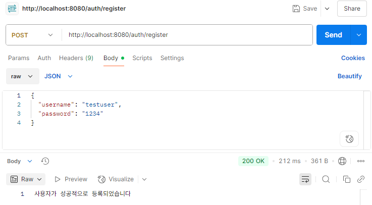
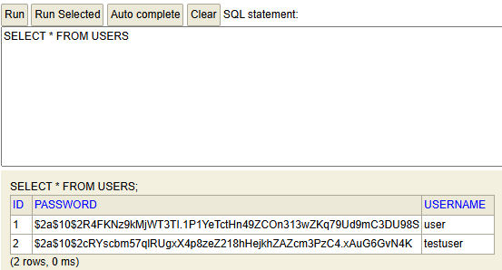
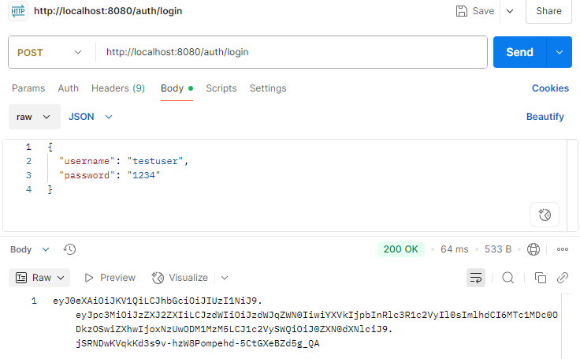
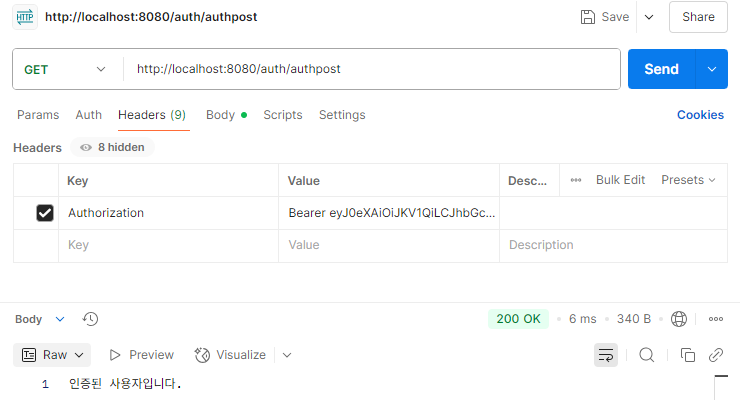
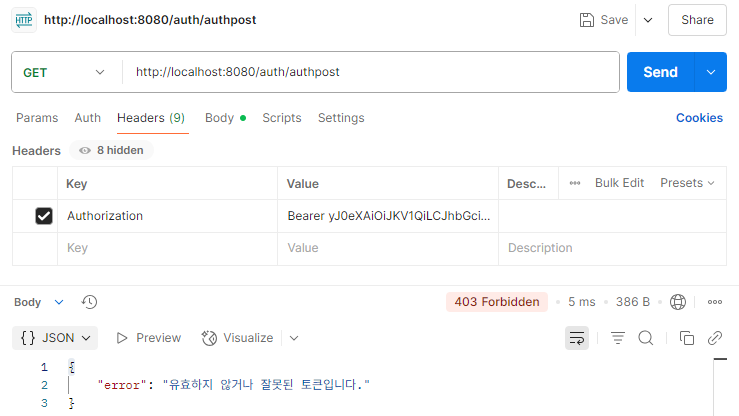

## 1. 구현 항목
- [X] 회원가입 (비밀번호 암호화 포함)
- [X] 로그인 (JWT 발급)
- [X] JWT 인증 필터 적용 (토큰 유효성 검사 및 인증 처리)
- [X] /auth/**, /h2-console/**는 예외 처리
- [X] 인증 필수 API(/authpost) 접근 시 토큰 없을 경우 차단
- [X] 유효하지 않은 토큰 예외 처리 (403 Forbidden)
- [X] H2 콘솔 및 메모리 DB 연동
- [ ] JWT 갱신(Refresh Token) 기능
- [ ] 예외 처리 전역 핸들러
---
## 2. 회원가입 확인

- 회원가입 시 비밀번호 암호화
---
## 3. 로그인 확인

- JWT Token 발급
---
## 4. JWT 필터 적용 후 인증 필요 요청 테스트
### - 인증 성공

### - 인증 실패
